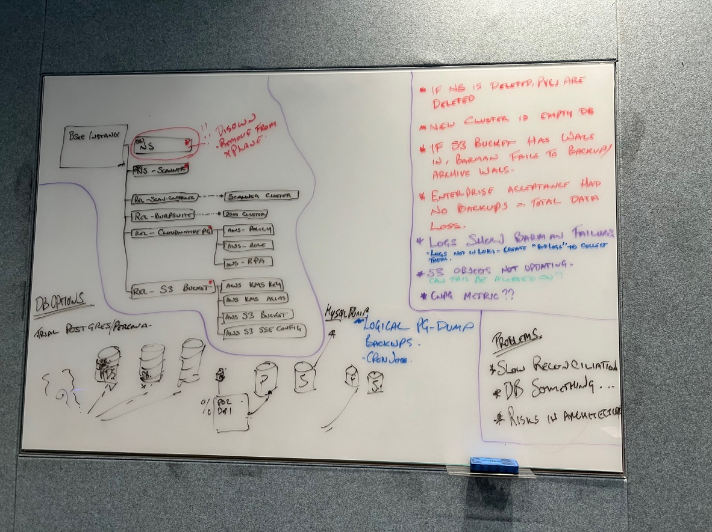

# 06-11-2023 - Data loss on Crossplane & Karpenter upgrade 

## Severity & Impact
None critical - only internal teams impacted, no customer data loss

## Issue Summary
Loss of all database clusters in the Platform BSEE Dev environment 

## Timeline
* 11:10 6th Nov 2023 - commit [80487b9](https://github.com/portswigger-cloud/bsee/commit/80487b90fd075e71b67ac774674fd15fdfa33135) upgraded crossplane from 1.13.2 -> 1.14.0 merged by Ben Smith.
* 15:13 6th Nov 2023 - commit [ca76859](https://github.com/portswigger-cloud/bsee/commit/ca76859f33c56f24df0443496abced7a78b2d18e) upgraded karpenter from 0.31.1 -> 0.32.1 via PR merged by Ben Smith.
* 10:00 7th Nov 2023 - The IT team noticed that status messages where not being sent by [statusaurus](https://github.com/portswigger-cloud/statusaurus) and investigated the issue.
* 10:49 7th Nov 2023 - The Tim Birkett determined that these 2 updates contained breaking changes and the team decided to forward fix them.
* 7-13th Nov - We forward fixed these two applications, in doing so all of the Kubernetes namespaces were accidentally deleted. This resulted in the destruction of the Postgresql clusters and their underlying PVCs. We also determined that a number of databases WAL were failing to write to AWS S3.

## Root Cause
Th removal of in-use Crossplane providers caused the deletion of provider related CRDs which included those that managed Kubernetes Namespaces.
As a result, the Kubernetes namespaces managed by Crossplane were deleted, resulting in the deletion of the cloudnative-pg clusters and associated Kubernetes PVCs.

New, empty database clusters were created. These new clusters were unable to perform backups as they would overwrite the existing backups in the S3 buckets.

## Resolution and recovery
Databases could be recreated through point in time backups where they exist, in other cases BSEE instances with blank database were recovered.

## Corrective and Preventative Measures
* Disown the Kubernetes customer instance namespace from Crossplane once it is created, prevent it from being inadvertently deleted in the future - [jira](https://portswigger.atlassian.net/browse/SAAS-309)
* Create alerts when database backups fail - [jira link](https://portswigger.atlassian.net/browse/SAAS-311)
* Take periodic logic (pg_dump) backups of each database and store it in S3 alongside the existing point in time backups. - [jira](https://portswigger.atlassian.net/browse/SAAS-313)
* Investigate the [Percona Operator for PostgreSQL](https://github.com/percona/percona-postgresql-operator) as a replacement from [cloudnative-pg](https://github.com/cloudnative-pg/cloudnative-pg) as we have seen a number of issues with cloudnative-pg which has undermined our confidence in their solution - [jira](https://portswigger.atlassian.net/browse/SAAS-312)

## White board session

