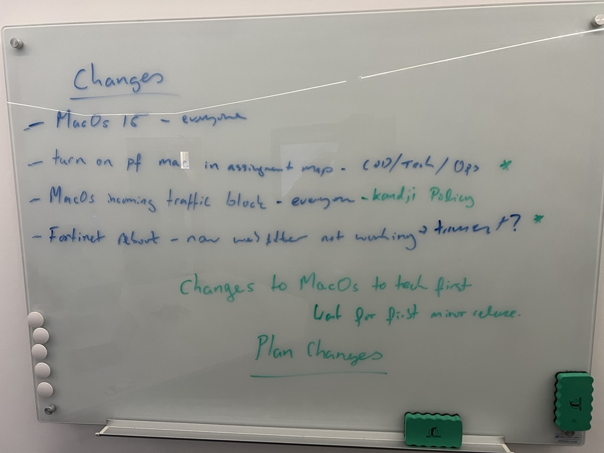

# 30-10-2024 - MacOs upgrade caused networking issues across the estate 

## Severity & Impact

## Issue Summary
End users Mac books had random and inconsistent network issues when trying to use firefox, terminal and other applications.

## Timeline
* 30-10-2024 08:30 - users stated to complain of network issues
* 30-10-2024 11:00 - Thought the issue may be to do with DHCP exhaustion on the Fortigate Firewalls caused by the new MacOs rotating MAC address feature. The DHCP lease time was reduced and the DHCP tables cleared.
* 30-10-2024 14:00 - More users started to have issues and it was determined that these were being caused by duplicate IP addresses as a result of clearing the DHCP table on the firewalls.
* 01-11-2024 08:00 - In order to solve the duplicate IP address issue the Firewalls where rebooted, on reboot there was an issue with the web filter and certificate validation. This was fixed by removing the web filtering while the cause was investigated.
* 01-11-2024 11:00 - The firewall certificate validation issue cleared by itself and it was discovered that MacOs packet filter was blocking random apps, in order to resolve this the packet filter was set to allow incoming connections.
* 01-11:2024 15:00 - Web filtering was re-enabled on the firewalls.
* 02-11-2024 09:00 - One user still had issues even after the change, we ended up wiping their laptop in order to solve it.

## Root Cause
It is believed that the root cause of all these issues is a bug in the MacOs network stack introduced in MacOs 15.0.0.

## Resolution and recovery
15.0.1 was rolled out as soon as it was released and seems to have resolved most of the issues now.

## Corrective and Preventative Measures
* We will not roll out any future versions of MacOs until at least a x.1.x patch has been release by Apple

## White board session

