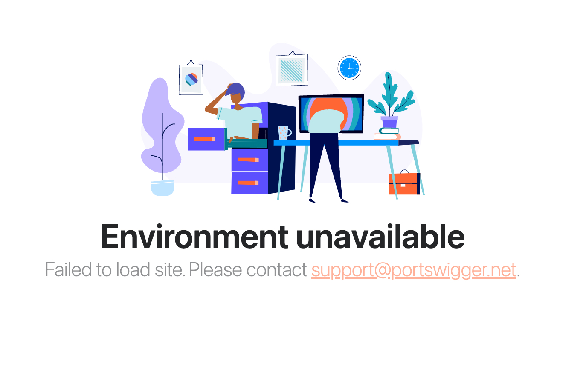
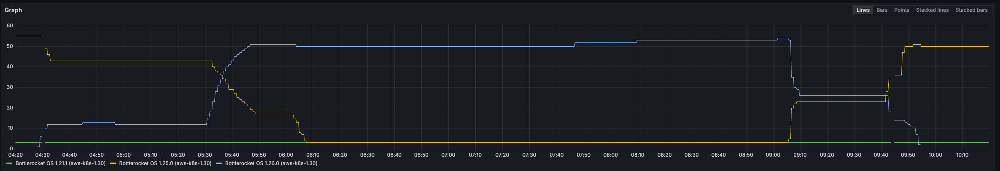
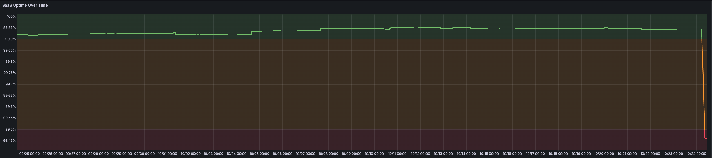

# 30-09-2024 - All instances not available to BSEE SaaS customers

## Impact

| Customers Impacted | Support Cases Raised |
|:---:|:---:|
| All | 1 |


## Issue Summary
All of our BSEE SaaS customer instances were displaying the Environment Unavailable message.


## Timeline
- 16-10-2024 11:58 - [PR-158](https://github.com/bottlerocket-os/bottlerocket-core-kit/pull/158) was merged into the Bottlerocket GitHub repository's default branch. This change Adds a default security setting to block writable/executable memory for all services.
```text
    MemoryDenyWriteExecute=yes
```
- 24-10-2024 02:00 - [Bottlerocket](https://github.com/bottlerocket-os) released [v1.26.0](https://github.com/bottlerocket-os/bottlerocket/releases/tag/v1.26.0), which included this PR.
- 24-10-2024 02:00-04:30 - AWS made v1.26.0 available as the latest Bottlerocket [AMI](https://docs.aws.amazon.com/AWSEC2/latest/UserGuide/AMIs.html) in the eu-west-1 region.
- 24-10-2024 04:00 - [Karpenter](https://github.com/kubernetes-sigs/karpenter) noticed that a new version of Bottlerocket was available and started the orchestrate the update of the EC2 nodes running in the production EKS cluster.

- 24-10-2024 04:45 - The SaaS Uptime Over Time Metric shows a significate drop of in availability percentage. 

- 24-10-2024 08:07 - AS posted a message reporting the outage to the BSEE cloud onboarding issues channel.
- 24-10-2024 - 08:15 - LB come to FS11 to let SB know verbally that there is an issue with SaaS.
    - Initial investigations reveled that all the customers kubernetes Pods where in crash loop back off and the logs showed the following error messages:
        ```text
        2024-10-24T07:34:22.609730903Z + /usr/local/burpsuite_enterprise/bin/createKeystore es /home/burpsuitekeystores/es.keystore 07E0q1lzbEdBx4us2vOfh5emvayVLK
        2024-10-24T07:34:22.614470565Z Error occurred during initialization of VM│
        2024-10-24T07:34:22.614485724Z Failed to mark memory page as executable - check if grsecurity/PaX is enabled
        2024-10-24T07:34:42.976849Z    Stream closed EOF for ps-xxxxxxxx-prod/ps-xxxxxxxx-prod-xxxxx-burpsuite-66774f6fb-p5jwx (init-enterprise-server-keystore)
        ```
    - SB suspected this was an OS issue from the error message and checked the AWS EC2 console, noticed that the EC2 nodes had been updated at 05:33 and workloads had been migrated to the new EC2 nodes after that.
    - He checked the version of the OS, noted it was v1.26.0 and looked for issues with this OS in the Bottlerocket GitHub repo. He found [Issue 4260](https://github.com/bottlerocket-os/bottlerocket/issues/4260) - Compatibility issues with the v1.26.0 of Bottlerocket when running Java-based applications.
- 24-10-2024 08:50 - TB arrived and SB handed the issue over to TB.
    - As SB had already diagnosed the cause of the issue TB started the process of reverting all of the EC2 instances in the SaaS production account back to [v1.25.0](https://github.com/bottlerocket-os/bottlerocket/releases/tag/v1.25.0)
- 24-10-2024 09:15 - Customer instances started to come back online and service was restored.

## Root Cause

[PR-158](https://github.com/bottlerocket-os/bottlerocket-core-kit/pull/158) was merged into the Bottlerocket default branch, this was then released in [v1.26.0](https://github.com/bottlerocket-os/bottlerocket/releases/tag/v1.26.0). This change to the OS config stopped applications that rely on JIT compilation, such as Java, from executing on v1.26.0 of the Bottlerocket OS.

## Resolution and recovery

## Corrective and Preventative Measures 